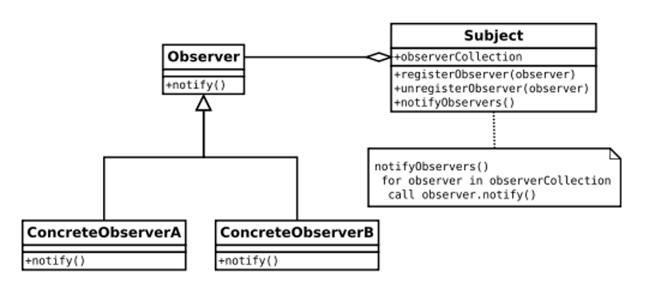
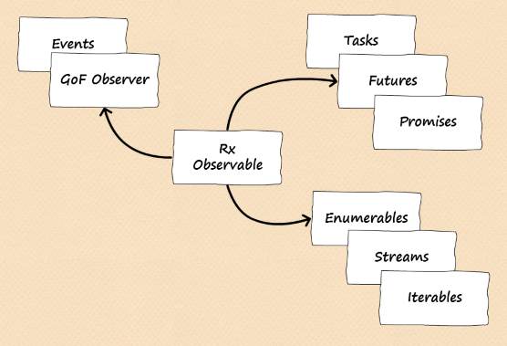
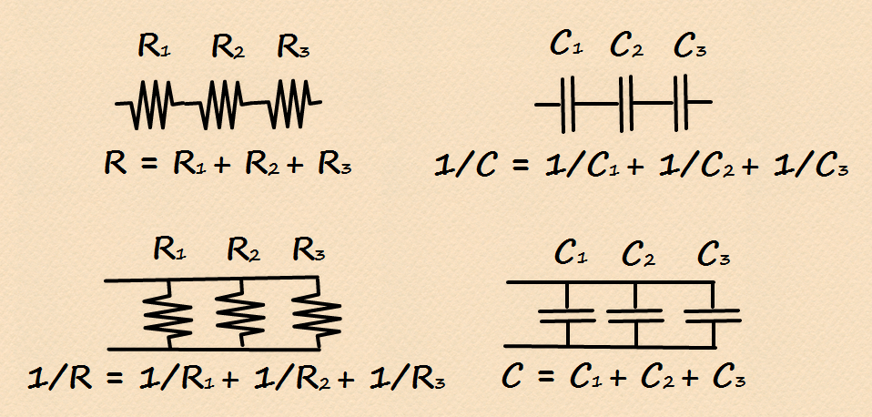

- title : Reactive Extensions, the answer to the ultimate question of life, the universe, and everything
- description : a gentle introduction to Reactive Extensions
- author : Milosz Krajewski
- theme : beige
- transition : default

***

## Reactive Extensions


### the answer to the ultimate question of life, the universe, and everything

***

### About me

- Milosz Krajewski
- BLOBAs @ Sepura
- self proclaimed FRP evangelist
- first line of code written in ~1984
- C, C++, C#, SQL, Java, Delphi
- (Iron)Python, F#, Scala, Kotlin

***

### Familiar != Easy != Simple

* Polish is neither **easy** nor **simple**, but for some people is **familiar**
* successful stock trading is **simple** (buy low and sell high), it's not **easy** though

---

Reactive programming is **simple** but not **easy**

***

### Observer Pattern



the GoF version in Java...

---

...and converted to C#

```csharp
public interface IObserver<T> {
    void OnNotification(T item); // Notify
}

public interface ISubject<T> {
    void Subscribe(IObserver<T> observer); // registerObserver
    void Unsubscribe(IObserver<T> observer); // unregisterObserver
    void Notify(T item); // notifyObservers
}
```

***

### .NET events are equivalent of GoF observers

```csharp
// Subject
public event Action<T> OnNotification; // = _ => {};

// Observer.OnNotification(item)
public void OnNotificationHandler(T item) { ... }

// Subject.Subscribe(Observer)
this.OnNotification += OnNotificationHandler;

// Subject.Unsubscribe(Observer)
this.OnNotification -= OnNotificationHandler;

// Subject.Notify(item)
this.OnNotification(item);
```

***

### What's wrong with .NET events?

* Not first-class citizens (cannot pass around)
* Clunky unsubscribe (anonymous handlers)
* Null event handlers (managing race conditions)
* Lapsed listener problem (event handler leak)

(Java does not really help you with events, either)

---

### Not first-class citizens

```csharp
public class Producer {
	public event EventHandler<int> OnProduced;
}

void AttachPrinter(EventHandler<int> handler) {
	handler += (s, e) => Console.WriteLine(e);
}

void Main() {
	var producer = new Producer();
	AttachPrinter(producer.OnProduced);
}
```

Does it compile?

---

<pre>
The event 'Producer.OnProduced' can only appear on the left hand
side of += or -= (except when used from within the type 'Producer')
</pre>

---

### Clunky unsubscribe

```csharp
public class Producer {
	public event EventHandler<int> OnProduced;
}

void Main() {
	var producer = new Producer();
	producer.OnProduced += (s, e) => Console.WriteLine(e);
	producer.OnProduced -= (s, e) => Console.WriteLine(e);
}
```

---

### Null event handlers

Official documentation does it wrong (https://goo.gl/CEK0xm):

```csharp
class Emitter {
    public event EventHandler<int> Changed;
    public void OnChanged(int newValue) {
        if (Changed != null)
            Changed(this, newValue); // BANG!!!
    }
}
```

---

Recommended solution:

```csharp
class Emitter {
    public event EventHandler<int> Changed;
    public void OnChanged(int newValue) {
        var handler = Changed;
        if (handler != null)
            handler(this, newValue);
    }
}
```

---

Recommended solution with extension method:

```csharp
public static class EventExtensions {
    public static void Raise<T>(
        this EventHandler<T> handler, object sender, T args)
    {
        if (handler == null) return;
        handler(this, args);
    }
}

class Emitter {
    public event EventHandler<int> Changed;
    public void OnChanged(int newValue) {
        handler.Raise(this, newValue);
    }
}
```

---

My personal winner is 'untouchable' lambda:

```csharp
class Emitter {
    public event EventHandler<int> Changed = (s, e) => { };
    public void OnChanged(int newValue) {
        Changed(this, newValue);
    }
}
```

---

### Lapsed listener problem

```csharp
public class LeakingForm: Form {
	public LeakingForm(EventBus bus) {
		bus.OnEvent += (s, e) => editBox.Text = e.Text;
	}
}
```

if lifetime of `form` and `bus` is different the form will leak...

---

...to avoid that, we need to unsubscribe on close,
but to unsubscribe we cannot use anonymous handler...

```csharp
public class LessLeakingForm: Form {
    public LessLeakingForm(EventBus bus) {
        bus.OnEvent += HandleTextEdit;
        FormClosed += (s, e) => bus.OnEvent -= HandleTextEdit;
    }
    public void HandleTextEdit(object sender, TextEventArgs args) {
        editBox.Text = args.Text;
    }
}
```

...now, for a change, the `bus` may leak even if no longer used

***

### So what are Reactive Extensions?

> An API for asynchronous programming with observable streams. -- reactivex.io

---

when reading between the lines we get:

* **observable**: Events
* **streams**: Enumerables
* **asynchronous**: Tasks



***

### Rx observables are like events<br>(and GoF subjects)

```csharp
public interface IObserver<T> { // GoF
    void OnNotification(T item);
}
```

```csharp
public interface IObserver<T> { // Rx
    void OnNext(T item);
}
```

---

### GoF vs Rx subjects

```csharp
public interface ISubject<T> {
    void Subscribe(IObserver<T> observer);
    void Unsubscribe(IObserver<T> observer);
    void Notify(T item);
}
```

GoF `ISubject` is actually two interfaces,<br>
(they missed abstraction opportunity)

```csharp
public interface IObservable<T> {
    void Subscribe(IObserver<T> observer);
    void Unsubscribe(IObserver<T> observer);
}

public interface ISubject<T>: IObservable<T> {
    void Notify(T item);
}
```

---

```csharp
public interface IObservable<T> {
    void Subscribe(IObserver<T> observer);
    void Unsubscribe(IObserver<T> observer);
}
```

`Unsubscribe` is actually redundant...


```csharp
public interface IObservable<T> {
    IDisposable Subscribe(IObserver<T> observer);
}
```

...if replaced by `IDisposable`

---

while `ISubject` is meant to be called...

```csharp
public interface ISubject<T>: IObservable<T> {
    void Notify(T item);
}
```

...the `IObserver` is mean to be implemented...

```csharp
public interface IObserver<T> {
    void OnNext(T item);
}
```

...but they are the same, therefore:

```csharp
public interface ISubject<T>: IObservable<T>, IObserver<T> { }
```

---

### Rx interfaces for events

```csharp
// Action<T>
public interface IObserver<T> {
    void OnNext(T item);
}

// Func<Action<T>, Action>
public interface IObservable<T> {
    IDisposable Subscribe(IObserver<T> observer);
}

public interface ISubject<T>: IObservable<T>, IObserver<T> { }
```

---

### So how can I use Rx for events?

The way to implement events is to use `Subject<T>`<br>(also known as `PublishSubject<T>`):

```csharp
var subject = new Subject<string>();
//...
subject.OnNext("is anyone listening?");
```

---

`Subscribe(...)` has overloads allowing to use lambdas:

```csharp
keyPressed.Subscribe(k => Console.WriteLine("Pressed: {0}", k));
```

(they create lightweight `IObserver<T>` behind the scene)

---

`Subscribe(...)` returns `IDisposable`:

```csharp
var subscription = keyPressed.Subscribe(...);
//...
subscription.Dispose();
```

...to help control subscription lifespan.

---

It's worth to invest into some kind of `DisposableBag`:

```csharp
public class DisposableBag: IDisposable {
    private List<IDisposable> _bag = new List<IDisposable>();
    public void Add(IDisposable other) { _bag.Add(other); }
    public void Dispose() { _bag.ForEach(d => d.Dispose()); }
}
```

(proper implementation should handle add-after-dispose, exception-on-dispose, and be thread-safe)

---

so multiple subscriptions can be managed:

```csharp
bag.Add(eventA.Subscribe(...));
bag.Add(eventB.Subscribe(...));
bag.Add(eventC.Subscribe(...));
//...
bag.Dispose();
```

---

What we have already:

* `IObservable<T>` can be passed around
* Lambda-friendly `Unsubscribe(...)`
* Null-aware `OnNext(...)`

---

So Rx event source is:

```csharp
public class Dice {
    private Random _generator = new Random();

    private ISubject<int> _rolled = new Subject<int>();
    public IObservable<int> OnRolled { get { return _rolled; } }

    public void Roll() {
        _rolled.OnNext(_generator.Next(6) + 1);
    }
}
```

...implemented with `Subject<T>`, exposed as `IObservable<T>`, triggered with `OnNext(T)`...

---

...while Rx event handler is:

```csharp
public class Player {
    public Player(Dice dice) {
        dice.OnRolled.Subscribe(
            d => Console.WriteLine("I see dice: {0}", d));
    }
}
```

...implemented with `Subscribe(...)` using (implicit) `IObserver`.

---

### Yes, I know

We did not address **Lapsed listener problem**. It's easy but not for free. Be patient.

***

### Rx observables are 'opposite' (dual) to enumerables



---

```csharp
SheetOfPaper Print(StreamOfBytes);
```


```csharp
StreamOfBytes Scan(SheetOfPaper);
```

---

### Swap inputs and outputs<br>(and find opposite name)

```csharp
int Parse(string);
string Render(int);
```

```csharp
byte[] Serialize<T>(T);
T Deserialize<T>(byte[]);
```

```csharp
void Consume<T>(T);
T Produce<T>(void);
```
---

Let's do this for `IEnumerable` and `IEnumerator`<br>(step by step)

---

```csharp
interface IEnumerable<T> {
    IEnumerator<T> GetEnumerator();
}
```

`IEnumerator` is also `IDisposable`

```csharp
interface IEnumerable<T> {
    (IDisposable & IEnumerator<T>) GetEnumerator(void);
}
```

---

```csharp
interface IEnumerator<T> {
    bool MoveNext();
    T Current { get; }
}
```

```csharp
interface IEnumerator<T> {
    (bool | Exception) MoveNext(void);
    T GetCurrent(void);
}
```

```csharp
interface IEnumerator<T> {
    (T | void | Exception) GetNext(void);
    // Either[Maybe[T], Exception]
}
```

---

### Magic!


### Swap inputs and outputs<br>(and find opposite name)

---

`IEnumerator` becomes `IObserver`

```csharp
interface IEnumerator<T> {
    (T | void | Exception) GetNext(void);
}

interface IObserver<T> {
    void PutNext(T | void | Exception);
}
```

---

`IEnumerable` becomes `IObservable`

```csharp
interface IEnumerable<T> {
    (IDisposable & IEnumerator<T>) GetEnumerator(void);
}

interface IObservable<T> {
    IDisposable SetObserver(IObserver<T>);
}
```

(`IDisposable` is technical detail)

---

setting and observer is subscribing:

```csharp
interface IObservable<T> {
    IDisposable SetObserver(IObserver<T>);
}
```

```csharp
interface IObservable<T> {
    IDisposable Subscribe(IObserver<T>);
}
```

---

```csharp
interface IObserver<T> {
    void PutNext(T | void | Exception);
}
```

`PutNext` is `OnNext`:

```csharp
interface IObserver<T> {
    void OnNext(T | void | Exception);
}
```

...in absence of discriminated unions,<br>
`OnNext` is implemented as three methods:

```csharp
interface IObserver<T> {
    void OnNext(T);
    void OnComplete(void);
    void OnError(Exception);
}
```

---

```csharp
// Action<T|void|Exception>
interface IObserver<T> {
    void OnNext(T);
    void OnComplete();
    void OnError(Exception);
}

// Func<Action<T|void|Exception>, Action>
interface IObservable<T> {
    IDisposable Subscribe(IObserver<T>);
}

public interface ISubject<T>: IObservable<T>, IObserver<T> { }
```

***

### So how can I use Rx for streams?

Almost every single operator defined for `IEnumerable<T>`<br>
can be expected for `IObservable<T>`:

```csharp
keyboard.OnKeyPressed
    .Select(k => k.ToUpper())
    .Where(k => k != 'A')
    // it's a different event here!
    .Subscribe(k => Console.WriteLine("Press 'A'. Try again."));
```

..the additional operators are usually related to managing **time** and **absence** of events.

---

### The operators are not magic

Here's `Where(...)`:

```csharp
public static IObservable<T> Where<T>(
    this IObservable<T> input, Func<T, bool> predicate)
{
    var output = new Subject<T>();
    input.Subscribe(v => { if (predicate(v)) output.OnNext(v); });
    return output;
}
```

---

...and `Select(...)`:

```csharp
public static IObservable<R> Select<T, R>(
    this IObservable<T> input, Func<T, R> selector)
{
    var output = new Subject<R>();
    input.Subscribe(v => output.OnNext(selector(v)));
    return output;
}
```

(this is **not** a good implementation,<br>
it just gives an idea how it works,<br>
use `Observable.Create(...)` instead)

---

| `IEnumerable<T>` | `IObservable<T>`    |
|:----------------:|:-------------------:|
| yield return i   | output.OnNext(i)    |
| yield break      | output.OnComplete() |
| throw e          | output.OnError(e)   |

***

### Rx observables are kind of like Promises

> In computer science, future (or promise) describes an object that acts as a
proxy for a result that is initially unknown, usually because the computation
of its value is yet incomplete. -- *Wikipedia* (kind of)

---

(...insert three hour talk about M-things...)

---

`Promise[T]` (we call it `Task<T>` in .NET) is the type which encapsulates the possibility of having `T` in the future.<br>

```csharp
task.ContinueWith(
    t => Console.WriteLine("Result finally received: {0}", t.Result));
```

When `task` returns/produces a value continuation is called with the value passed in `Result` property.

---

...and that's exactly what `IObservable<T>` does as well:<br>
it calls `OnNext(T)` for all subscribers when result is produced.

---

`Task<T>` is a little bit more than just `Promise[T]`,<br>
it is actually `Promise[Either[T, Exception]]`,<br>
as it may deliver `Exception` instead of `T`.

```csharp
task.ContinueWith(
    t => Console.WriteLine("Task crashed with: {0}", t.Exception),
    TaskContinuationOptions.OnlyOnFaulted);
```

When `task` throws an exception continuation is called with exception passed in `Exception` property.

---

...and that's exactly what `IObservable<T>` does as well:<br>
it calls `OnError(Exception)` for all subscribers when exception is thrown.

---

`Task` (no `<T>`) does not really deliver value,<br>
it just finishes at some point in time.<br>
Let's say it is `Promise[Either[Unit, Exception]]`.

```csharp
task.ContinueWith(
    t => Console.WriteLine("Yup, done."),
    TaskContinuationOptions.OnlyOnRanToCompletion);
```

When `task` finishes it does not deliver value, it calls continuation with information saying "yup, it's finished".

---

...and that's exactly what `IObservable<T>` does as well:<br>
it calls `OnComplete()` for all subscribers when sequence is finished.

***

|                    | One       | Many             |
|-------------------:|:---------:|:----------------:|
| **Synchronously**  | `T`       | `IEnumerable<T>` |
| **Asynchronously** | `Task<T>` | `IObservable<T>` |

***

### So how to use it?

---

---

```csharp
public void LongRunningOperation(bool debug) {
    while (!finished) {
        if (debug) executeDebugActions();
        executeStandardActions();
    }
}
```

---

```csharp
public void LongRunningOperation(Func<bool> debugQuery) {
    while (!finished) {
        if (debugQuery()) executeDebugActions();
        executeStandardActions();
    }
}
```

---

```csharp
public void LongRunningOperation(IObservable<bool> debugStream) {
    var debugStream.Capture();
    while (!finished) {
        if (debug()) executeDebugActions();
        executeStandardActions();
    }
}
```


```


***

### http://reactivex.io

**Bart de Smet** @ DevCamp 2010<br>
"Rx: Curing your asynchronous programming blues"<br>
http://bit.ly/1qsXfsx

**Mike Taulty** @ DevDays 2011<br>
"Reactive Extensions for .NET for the Rest of Us"<br>
http://bit.ly/1PSoukV
